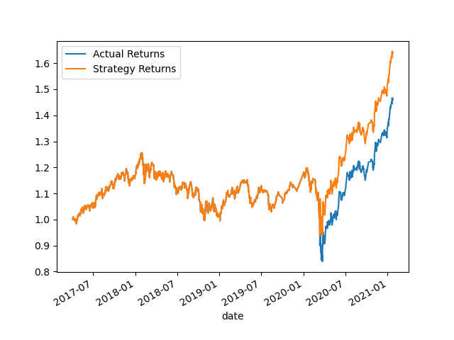
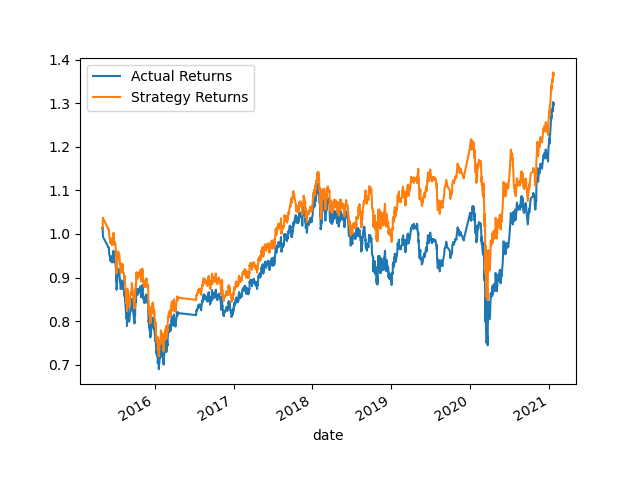
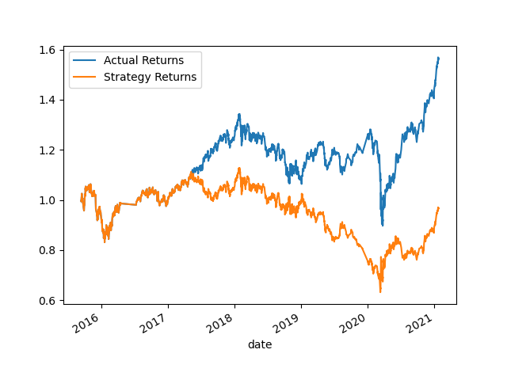
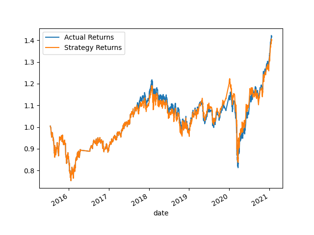
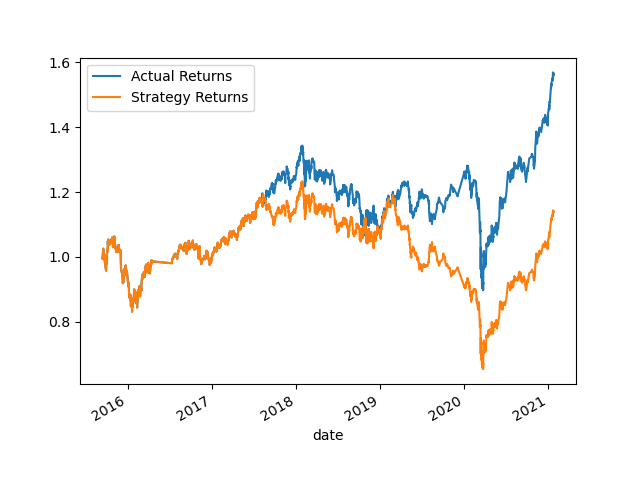
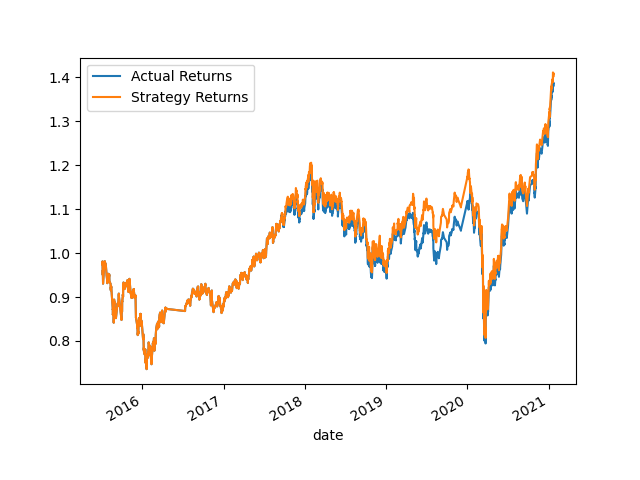
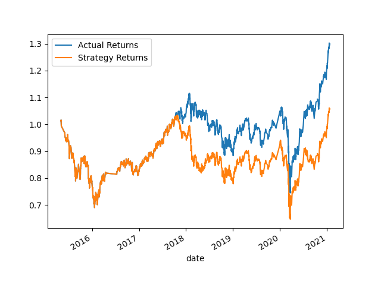
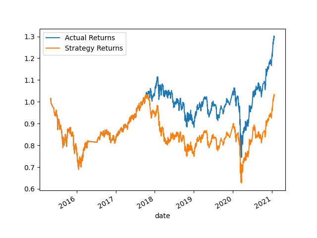
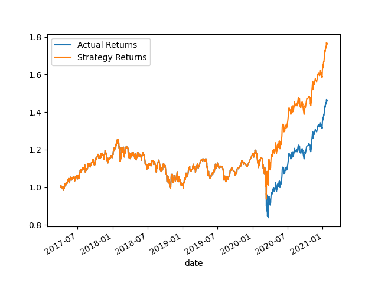
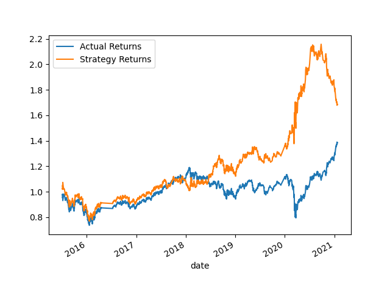

# Machine Learning Trading Bot

This project aims to trade with much speeder than humans by using computer algorithms. The goal is to create a machine learning algorithm that adapts to new data to automatically trade assets.

## ABOUT
Competition is truculent in the financial advisory firm industry. The enviromnent has a constant change and automate trades gives an upper edge on the competition. Machine Learning Classifiers from the scikit-learn package will be used to generate a model and make predictions. Backtesting methods will then be used to evaluate the performance of the model in practice. The results will then be used to tune the model until a targetted model is found.


## TO START
To run the Jupyter notebook and interact with the visualizations, you need to have the following software and Python libraries installed:

* Python 3.10 or later
* Anaconda Distribution
* Pandas
* scikit-learn

## INSTALLATION

1. Install latest version of Python. [here](https://www.python.org/downloads/).
2. Install the latest version of Anaconda. [here](https://www.anaconda.com/download).
3. Installing Anaconda includes the Pandas package.
4. To install the scikit-learn packages, run the following command in your terminal.

```
pip install -U scikit-learn
```

## USAGE
Clone or download this Github Project and open the `machine_learning_trading_bot.ipynb` using Jupyter Notebook. The Notebook is divided into sections covering different aspects, each sections have explaination and code snippets.

# Report
## Establish a Baseline Performance

<p align="center">
    
</p>

By inspecting the baseline perfomance depicted by the figure above, it is evident that the cumulative strategy returns is greater than that of the actual returns by approximately 15%. The overall portfolio returns from the strategy is approximately 50%.

## Tune the Baseline Trading Algorithm

<center>
    <h3>Adjusting the Size of the Training Dataset</h3>
</center>

|  |  | 
|:--:|:--:| 
| *Increase the training window to 24 months* |*Decrease the training window to 1 month* |

Both increasing and decreasing the training window kept the final cumulative strategy returns above the actual returns, but compared to the baseline they both have their tradeoffs.

Decreasing the training window decreased the cumulative strategy returns by approximately 15% compared to the baseline, however the strategy returns was greater than the actual returns throughout the entire period.

Increasing the training window increased the cumulative strategy returns by approximately 15% compared to the baseline, however the strategy returns was about equal to the actual returns from the begining of the period to about March 2020. It was after March 2020 when the strategy returns overtook the actual returns.

<center>
    <h3>Adjusting the SMA Input Features</h3>
</center>

| | | |
|:--:|:--:|:--:|
|*Increase the Short SMA Window to 20*|*Increase the Long SMA Window to 150*|*Increase both the Short and Long SMA Windows*|

Increasing only the short and both SMA windows resulted in a significant decrease in the cumulative strategy returns that is even lower than the actual returns, whereas increasing only the long SMA window decreased the cumulative strategy returns by approximately 1-2% compared to the actual returns.

| | | |
|:--:|:--:|:--:|
|*Decrease the Short SMA Window to 2*|*Decrease the Long SMA Window to 20*|*Decrease both the Short and Long SMA Windows*|

Decreasing only the long and both SMA windows resulted in a significant decrease in the cumulative strategy returns that is even lower than the actual returns, whereas decreasing only the short SMA window increased the cumulative strategy returns by approximately 1-2% compared to the actual returns.

In this step, decreasing only the short SMA window resulted in the final cumulative strategy returns above actual returns, however it is still approximately 10% lower compared to the baseline strategy.

<center>
    <h3>Final Tuning Parameters</h3>
</center>

<p align="center">
    
</p>

Based on the results of adjusting both the size of the training dataset and SMA input features the best combination of parameters are increasing the training size and decreasing only the short SMA window.

This tuned model provides the best results increasing the cumulative strategy returns by approximately 25% compared to the baseline. The overall portfolio returns from the strategy in the tuned model is approximately 75%.

## Evaluate A New Machine Learning Classifier

<p align="center">
    
</p>

By inspecting the new model's perfomance depicted by the figure above, the most notable aspect is the peak in the cumulative strategy returns in mid-2020. The peak of the cumulative strategy returns is greater than that of the baseline by approximately 60% and greater than that of the tuned model by 35%. Thus, in mid-2020 the overall portfolio returns from the strategy in the new model is approximately 115%, more than doubling the initial investment.

In reality, the peak is not the final cumulative strategy returns. The final cumulative strategy returns of the new model is approximately 1.7, which means the new model performs better than the baseline, but about the same, if not a little worse than the tuned model. 

## Conclusion

From All, the best model seems to be the tuned trading algorithm. Although this model showed the best results, it seems to perform well only in a trending market. Between the beginning of the period to about March 2020, the strategy returns is equal to the actual returns. It was not until after March 2020, when the closing price of the asset drastically increased did the strategy returns increase as well and overtook the actual returns.

## Contributor
Harshita Panchal


© 2022 edX Boot Camps LLC. Confidential and Proprietary. All Rights Reserved.
